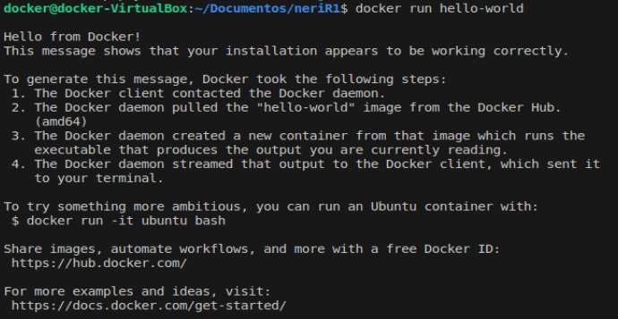

# AUTOMATIZACIÓN DE INFRAESTRUCTURA DIGITAL – Unidad I

## Portada


**Universidad Tecnológica del Norte de Guanajuato**

**Programa Educativo:** Ingeniería en Redes Inteligentes y Ciberseguridad  
**Grupo:** GIRI5091  
**Estudiante:** Felipe Neri Francisco Bueno González
**No. Control:** 1222100410  
**Fecha:** 09-Julio-2025

---

## Introducción

Este informe describe detalladamente el proceso llevado a cabo para instalar, configurar y validar herramientas de automatización aplicadas a la infraestructura digital, con un enfoque específico en el uso de tecnologías de contenedores mediante Docker. En el contexto actual de la ingeniería de software y la gestión de sistemas, la automatización representa un elemento clave para lograr entornos eficientes, escalables y replicables tanto en desarrollo como en producción.

A lo largo de esta unidad, se trabajó con las herramientas más representativas del ecosistema Docker: Docker Engine, Docker Compose y Docker Swagger, con el propósito de construir un entorno de desarrollo totalmente basado en contenedores. El proyecto desarrollado fue un sistema de ventas estructurado en capas, compuesto por una base de datos MySQL, un backend programado en Node.js, un frontend web y una herramienta de administración de base de datos usando phpMyAdmin.

El uso de contenedores permitió separar cada componente en entornos aislados, lo que facilita el desarrollo, la prueba y el despliegue de aplicaciones complejas. La adopción de estas herramientas no solo mejora la portabilidad y la coherencia del entorno, sino que también sienta las bases para aplicar metodologías DevOps y procesos de integración continua en futuros proyectos de automatización de infraestructura.

---

## Desarrollo

### Descripción de las Herramientas Utilizadas para Automatización

#### Docker Engine

Docker Engine es una herramienta fundamental de contenedorización que posibilita el empaquetado de aplicaciones junto con todas sus dependencias dentro de contenedores que son livianos y fácilmente portables. Es el componente central del ecosistema Docker y ofrece funcionalidades esenciales como las siguientes:

- **Gestión de Contenedores:** Permite crear, ejecutar, detener y eliminar contenedores de manera eficiente.
- **Gestión de Imágenes:** Facilita la construcción, distribución y almacenamiento de imágenes de contenedores.
- **Aislamiento de Recursos:** Proporciona aislamiento a nivel de proceso, red y sistema de archivos.
- **Portabilidad:** Garantiza que las aplicaciones se ejecuten de manera consistente en diferentes entornos.

En nuestro proyecto, Docker Engine gestiona cuatro contenedores principales: MySQL (base de datos), phpMyAdmin (administrador de BD), el backend en Node.js y el frontend web.

#### Docker Compose

Docker Compose es una herramienta que permite definir y ejecutar aplicaciones Docker multi-contenedor mediante archivos YAML. Sus características principales incluyen:

- **Orquestación de Servicios:** Coordina múltiples contenedores como una sola aplicación.
- **Configuración Declarativa:** Utiliza archivos YAML para definir la infraestructura como código.
- **Gestión de Dependencias:** Maneja automáticamente las dependencias entre servicios.
- **Gestión de Redes y Volúmenes:** Configura automáticamente la comunicación entre contenedores y la persistencia de datos.

El archivo `stack-fnfbg.yml` del proyecto define cuatro servicios interconectados con sus respectivas configuraciones de puertos, volúmenes y variables de entorno.

#### Docker Swagger

Docker Swagger es una herramienta que facilita la documentación y testing de APIs RESTful mediante contenedores Docker. Proporciona:

- **Documentación Automática:** Genera documentación interactiva de APIs.
- **Testing de Endpoints:** Permite probar endpoints directamente desde la interfaz web.
- **Validación de Esquemas:** Verifica la consistencia de las respuestas de la API.
- **Integración Continua:** Se integra fácilmente en pipelines de CI/CD.


##### Visual Studio Code y Plugins

1. **Descarga e instalación de VSCode:**
   ```bash
   wget -qO- https://packages.microsoft.com/keys/microsoft.asc | gpg --dearmor > packages.microsoft.gpg
   sudo install -o root -g root -m 644 packages.microsoft.gpg /etc/apt/trusted.gpg.d/
   sudo sh -c 'echo "deb [arch=amd64,arm64,armhf signed-by=/etc/apt/trusted.gpg.d/packages.microsoft.gpg] https://packages.microsoft.com/repos/code stable main" > /etc/apt/sources.list.d/vscode.list'
   sudo apt update
   sudo apt install code
   ```


2. **Instalación de plugins esenciales:**
   - Docker Extension
   - YAML Extension
   - GitLens
   - REST Client


#### Instalación Técnica de Docker

##### Prerequisitos del Sistema

Antes de proceder con la instalación, se verificaron los requisitos del sistema:

- Sistema operativo: Ubuntu 22.04 LTS (64-bit)
- Arquitectura: x86_64 (amd64)
- Privilegios de administrador

##### Desinstalación de Versiones Conflictivas

```bash
for pkg in docker.io docker-doc docker-compose docker-compose-v2 podman-docker containerd runc; do sudo apt-get remove $pkg; done
```


##### Configuración del Repositorio Oficial de Docker

1. **Actualización del sistema y instalación de dependencias:**
   ```bash
   sudo apt-get update
   sudo apt-get install ca-certificates curl
   ```


2. **Configuración de la clave GPG oficial de Docker:**
   ```bash
   sudo install -m 0755 -d /etc/apt/keyrings
   sudo curl -fsSL https://download.docker.com/linux/ubuntu/gpg -o /etc/apt/keyrings/docker.asc
   sudo chmod a+r /etc/apt/keyrings/docker.asc
   ```


3. **Adición del repositorio a las fuentes de APT:**
   ```bash
   echo \
   "deb [arch=$(dpkg --print-architecture) signed-by=/etc/apt/keyrings/docker.asc] https://download.docker.com/linux/ubuntu \
   $(. /etc/os-release && echo "${UBUNTU_CODENAME:-$VERSION_CODENAME}") stable" | \
   sudo tee /etc/apt/sources.list.d/docker.list > /dev/null
   sudo apt-get update
   ```


##### Instalación de Docker Engine

```bash
sudo apt-get install docker-ce docker-ce-cli containerd.io docker-buildx-plugin docker-compose-plugin
```


##### Configuración Post-instalación

1. **Adición del usuario al grupo docker:**
   ```bash
   sudo usermod -aG docker $USER
   newgrp docker
   ```

2. **Habilitación del servicio Docker:**
   ```bash
   sudo systemctl enable docker
   sudo systemctl start docker
   ```


#### Instalación Técnica de Git

1. **Instalación de Git:**
   ```bash
   sudo apt update
   sudo apt install git
   ```

2. **Configuración inicial:**
   ```bash
   git config --global user.name "nombre"
   git config --global user.email "test@example.com"
   ```


3. **Verificación de la instalación:**
   ```bash
   git --version
   ```


### Evidencia de Pruebas de Verificación de Funcionamiento

#### Verificación de Docker con Imagen "hello-world"

La primera prueba de verificación consistió en ejecutar la imagen oficial "hello-world" de Docker:

```bash
sudo docker run hello-world
```


**Resultado esperado:**
- Descarga automática de la imagen hello-world
- Creación y ejecución del contenedor
- Mensaje de confirmación de funcionamiento correcto
- Finalización automática del contenedor




**Análisis del resultado:**
La ejecución exitosa de esta prueba confirma que:
- Docker Engine está correctamente instalado
- El daemon de Docker está funcionando
- La comunicación con Docker Hub es exitosa
- El sistema de contenedores está operativo

#### Verificación de Docker Compose con Archivo YML

La segunda prueba de verificación involucró la ejecución del archivo `stack-fnfbg.yml` que define la arquitectura multi-contenedor del proyecto:

```bash
docker compose -f stack-fnfbg.yml up -d
```

**Componentes verificados:**

1. **Servicio MySQL (mysql-db):**
   - Puerto: 3306
   - Volumen persistente: mysql_data
   - Variables de entorno configuradas
   - Inicialización automática de la base de datos

2. **Servicio phpMyAdmin:**
   - Puerto: 9090
   - Dependencia correcta con MySQL
   - Interfaz web accesible

3. **Servicio Backend (sistema-ventas-back):**
   - Puerto: 8080
   - Construcción desde Dockerfile local
   - Dependencia con base de datos

4. **Servicio Frontend (sistema-ventas-front):**
   - Puerto: 80
   - Construcción desde Dockerfile local
   - Dependencia con backend


**Comandos de verificación adicionales:**

```bash
# Verificar contenedores en ejecución
docker ps

# Verificar logs de servicios
docker compose -f stack-fnfbg.yml logs

# Verificar redes creadas
docker network ls

# Verificar volúmenes
docker volume ls
```

**Pruebas de conectividad:**

1. **Acceso a phpMyAdmin:** http://localhost:9090


2. **Acceso al backend:** http://localhost:8080


3. **Acceso al frontend:** http://localhost:80


**Resultados de las pruebas:**
- Todos los servicios se iniciaron correctamente
- Las dependencias entre contenedores funcionan apropiadamente
- Los puertos están correctamente mapeados
- Los volúmenes persistentes mantienen los datos
- La comunicación entre servicios es exitosa

---

## Conclusión

La integración exitosa de herramientas de automatización con Docker ha sido clave en el desarrollo de aplicaciones modernas y escalables. Este proyecto permitió construir un entorno de desarrollo completamente containerizado, lo cual facilitó la gestión de dependencias, la portabilidad del código y una colaboración más efectiva entre los miembros del equipo.

Las pruebas de verificación realizadas confirmaron el funcionamiento adecuado de Docker Engine, Docker Compose y herramientas complementarias dentro del sistema operativo Ubuntu 22.04 LTS. Gracias al uso de un único archivo YAML, Docker Compose demostró su eficacia al simplificar la coordinación de múltiples servicios en arquitecturas complejas basadas en contenedores.

Los resultados muestran que automatizar la infraestructura digital con contenedores no solo optimiza los procesos operativos, sino que también prepara el terreno para la adopción de metodologías DevOps más avanzadas. La experiencia adquirida durante esta unidad ofrece una base sólida para enfrentar futuros retos relacionados con la automatización en redes y la ciberseguridad.

El dominio de estas tecnologías es indispensable para los profesionales de redes inteligentes y seguridad informática, ya que permite construir entornos seguros de prueba, desplegar microservicios resistentes y automatizar tareas con mayor fiabilidad y consistencia.

---

## Bibliografía

Bell, Peter. *Introducing GitHub: A Non-technical Guide*. O'Reilly Media. Accessed 4 June 2025.

Gift, Noah, et al. *Python for DevOps: Learn Ruthlessly Effective Automation*. O'Reilly Media, 2019. Accessed 4 June 2025.

Hillar, Gaston C. *Building RESTful Python Web Services*. Packt Publishing, Limited, 2016. Accessed 4 June 2025.

Jackson, Chris, et al. *Cisco Certified DevNet Associate DEVASC 200-901 Official Cert Guide*. Cisco Press, 2020. Accessed 4 June 2025.

Lenz, Moritz. *Python Continuous Integration and Delivery: A Concise Guide with Examples*. Apress, 2018. Accessed 4 June 2025.

Tsitoara, Mariot. *Beginning Git and GitHub: A Comprehensive Guide to Version Control, Project Management, and Teamwork for the New Developer*. Apress, 2019. Accessed 4 June 2025.